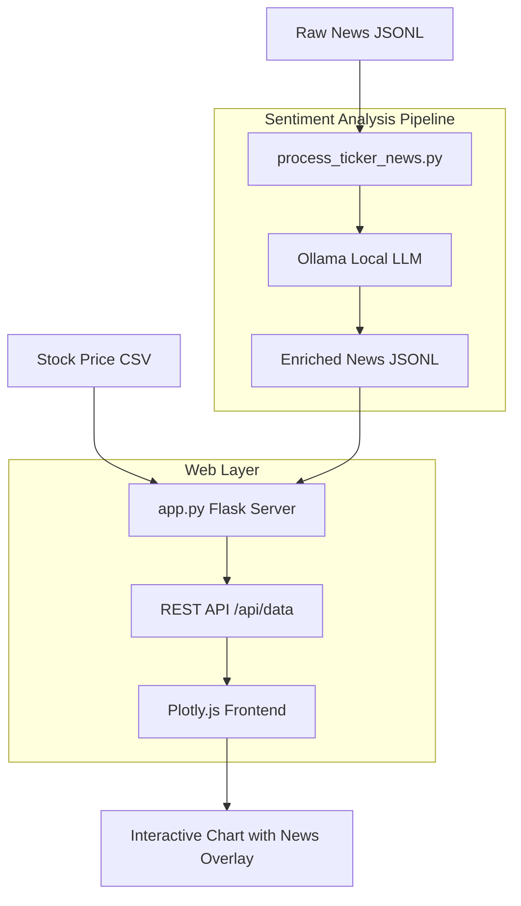

# NewsEffect


**Visualize how financial news sentiment correlates with stock price movements — powered by a local LLM, no API keys required.**

---

## The Problem

When analyzing a stock's price history, context is everything. A candlestick chart tells you *what* happened to the price, but not *why*. Traders and researchers typically have to:

1. Look at a price chart in one tab
2. Search for news from that date in another tab
3. Manually read articles to gauge sentiment
4. Repeat for every significant price move

This is slow, error-prone, and impossible to do at scale across hundreds of trading days.

## The Solution

NewsEffect collapses that workflow into a single interactive chart. It runs every news article through a local LLM (`finance-summarizer-qwen2.5:1.5b` via Ollama) to extract **sentiment**, **market impact**, and **confidence score** — then plots color-coded dots directly on the price chart, one dot per article per day.

Hover over any dot → see article titles, clickable source links, sentiment badges, and AI-generated market impact summaries, all without leaving the chart.

---

## How It Works



---

## Features

- **Interactive candlestick chart** with volume bars via Plotly.js
- **News sentiment overlay** — colored dots stacked at the bottom of the chart, one per article per day
- **Hover tooltip** showing article titles, clickable source links, sentiment badges, confidence scores, and LLM-generated market impact summaries
- **Local LLM inference** via Ollama — no API keys, no external calls, runs fully offline
- **Multi-ticker support** — drop in a new ticker folder and switch the config variable

---

## Tech Stack

| Layer | Technology |
|-------|-----------|
| Web server | Flask |
| Data processing | Pandas |
| Sentiment analysis | Ollama + `finance-summarizer-qwen2.5:1.5b` |
| Frontend chart | Plotly.js 2.27 |
| News storage | JSONL |
| Price data | CSV (Investing.com format) |

---

## Project Structure

```
NewsEffect/
├── app.py                          # Flask server + API endpoint
├── process_ticker_news.py          # LLM sentiment analysis pipeline
├── process_ticker_news_updated.py  # Updated pipeline with explicit prompts
├── generate_sentiment.py           # Debug script — prints articles by date
├── templates/
│   └── index.html                  # Plotly.js frontend
└── tickers/
    ├── micron-tech/
    │   ├── master_micron-tech_articles.jsonl      # Raw scraped news
    │   ├── processed_micron-tech_articles.jsonl   # LLM-enriched news
    │   └── Micron Stock Price History.csv
    └── nvidia-corp/
        └── NVIDIA Stock Price History.csv
```

---

## Prerequisites

- Python 3.10+
- [Ollama](https://ollama.ai) installed and running
- The `finance-summarizer-qwen2.5:1.5b` model pulled in Ollama

```bash
ollama pull finance-summarizer-qwen2.5:1.5b
```

---

## Setup

```bash
# Clone the repo
git clone https://github.com/your-username/NewsEffect.git
cd NewsEffect

# Install dependencies
pip install flask pandas ollama

# Start Ollama (if not already running)
ollama serve
```

---

## Usage

### 1. Analyze news sentiment

Run the sentiment pipeline against your raw articles JSONL:

```bash
python process_ticker_news.py
```

This reads `tickers/{ticker}/master_{ticker}_articles.jsonl`, calls the local LLM for each article, and writes `processed_{ticker}_articles.jsonl` with three new fields:

```json
{
  "market_impact": "positive",
  "sentiment": "positive",
  "confidence_score": 0.87
}
```

### 2. Start the web server

```bash
python app.py
```

Visit `http://localhost:5000` — the chart loads automatically.

### 3. Switch tickers

Edit the `ticker` variable at the top of `app.py` and `process_ticker_news.py`:

```python
ticker = "nvidia-corp"   # must match folder name under tickers/
```

---

## Adding a New Ticker

1. Create `tickers/{your-ticker}/` directory
2. Drop in a CSV with columns: `Date, Price, Open, High, Low, Vol.` (Investing.com export format)
3. Create `master_{your-ticker}_articles.jsonl` — one JSON object per line with at minimum:
   ```json
   {"title": "...", "content": "...", "time": "YYYY-MM-DD HH:MM:SS", "link": "...", "source": "...", "type": ""}
   ```
4. Run `process_ticker_news.py` with the ticker updated
5. Update `ticker` in `app.py` and launch

---

## Article JSONL Schema

| Field | Type | Description |
|-------|------|-------------|
| `title` | string | Article headline |
| `content` | string | Full article text (or `"PAID"` for paywalled) |
| `time` | string | `YYYY-MM-DD HH:MM:SS` |
| `link` | string | Source URL |
| `source` | string | Publisher name |
| `type` | string | `""` or `"Pro"` (Pro articles are filtered out) |
| `sentiment` | string | *(added by pipeline)* `positive` / `negative` / `neutral` |
| `market_impact` | string | *(added by pipeline)* LLM summary of market effect |
| `confidence_score` | float | *(added by pipeline)* `0.0` – `1.0` |

---

## License

MIT
